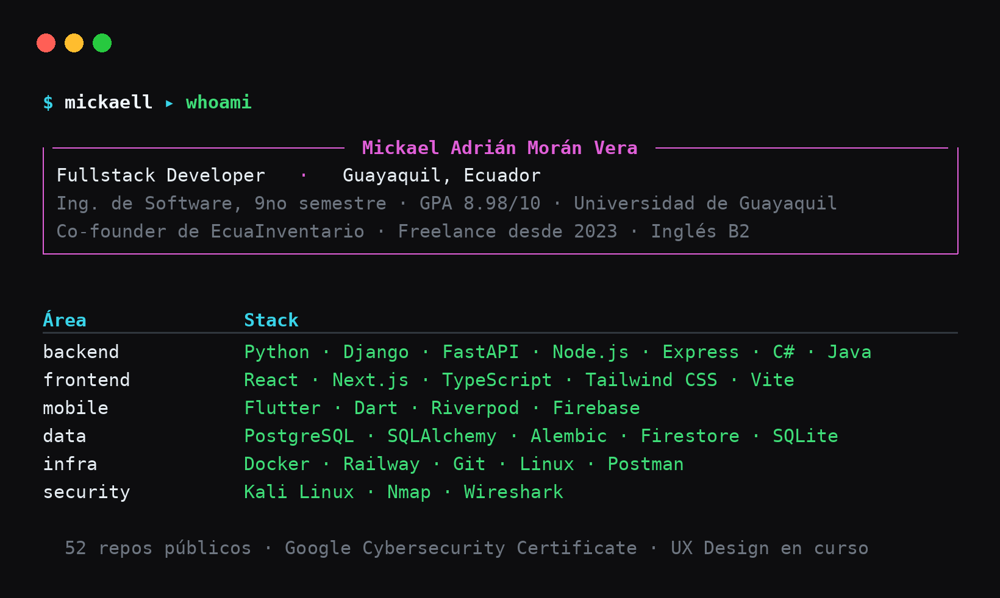

 
 

### I build complete web and mobile systems — from database to interface.

**Construyo sistemas web y móviles completos — desde la base de datos hasta la interfaz.**
 
**Real clients, my own systems in production, and my own tools when the existing ones don't fit.**

 

 

 

[**Stack**](#stack) • [**Projects**](#projects) • [**Experience**](#experience) • [**Security**](#security) • [**Contact**](#contact)

---

## About

9th-semester Software Engineering student at Universidad de Guayaquil (GPA 8.98/10), co-founder of a SaaS in production and freelance developer since 2023. I work end to end: database design, API, web and mobile client, deployment.

*Estudiante de 9no semestre de Ingeniería de Software en la Universidad de Guayaquil (GPA 8.98/10), co-fundador de un SaaS en producción y desarrollador freelance desde 2023. Trabajo de punta a punta: diseño de base de datos, API, cliente web y móvil, despliegue.*

---

## Stack

**Backend**

**Frontend**

**Mobile**

**Data & Infra**

**Also / También**

---

## Projects

### In production · En producción

**[EcuaInventario](https://github.com/Mickaell22/EcuaInventario_Backend)** — Multitenancy SaaS for the restaurant industry: inventory, orders and subscription billing, with an AI assistant that reads text, audio and invoice photos. Django 5 + DRF + PostgreSQL, Flutter + Riverpod, Claude + Whisper.
 *SaaS multitenancy para negocios gastronómicos, con asistente IA que interpreta texto, audio y fotos de facturas.*
[`backend`](https://github.com/Mickaell22/EcuaInventario_Backend) · [`app`](https://github.com/Mickaell22/EcuaInventario_Frontend)

**[Facturador](https://github.com/Mickaell22/Facturador_Backend)** — Billing, orders and customer management with e-invoicing integrated into Ecuador's SRI. Running in production at [novamicktools.com](https://novamicktools.com). FastAPI + PostgreSQL + React + Tailwind.
 *Sistema propio de facturación electrónica con integración al SRI, en producción.*
[`backend`](https://github.com/Mickaell22/Facturador_Backend) · [`frontend`](https://github.com/Mickaell22/Facturador_Frontend)

**[Centro Tía Glenda](https://github.com/Mickaell22/ProjectTiaGlendaFrontend)** — Clinical management system for a special therapy center: multi-role, multi-center, 190+ components. React + MUI + Flask + PostgreSQL. Real client, delivered.
 *Sistema de gestión clínica para centro de terapia especial. Cliente real, entregado.*
[`frontend`](https://github.com/Mickaell22/ProjectTiaGlendaFrontend) · [`backend`](https://github.com/Mickaell22/ProjectTiaGlendaBackend)

**[SimuladorPreguntas](https://github.com/Mickaell22/SimuladorPreguntasBackend)** — Entrance exam simulator deployed at Universidad de Guayaquil: question bank, role-based access, anti-cheating measures and XML export. Node.js + React + PostgreSQL + Docker.
 *Simulador de exámenes de ingreso desplegado en la Universidad de Guayaquil.*

### My own tools · Herramientas propias

**[mcp-context-server](https://github.com/Mickaell22/mcp-context-server)** — MCP server for Claude Code: semantic codebase indexing with ChromaDB and DeepSeek compression, so an agent can query a whole repo in natural language without burning the context window. Python + PostgreSQL.
 *Servidor MCP para indexar repositorios y consultarlos en lenguaje natural.*
  · [`dashboard`](https://github.com/Mickaell22/mcp-context-dashboard)

**[Respondón](https://github.com/Mickaell22/Respondon)** — Android app that detects your screenshots, extracts the text with on-device OCR (ML Kit) and answers in a floating bubble via DeepSeek. Kotlin + Jetpack Compose.
 *App Android con OCR local que responde tus capturas en una burbuja flotante.*

**[MotoVox](https://github.com/Mickaell22/MotoVox)** — Intercom for motorcycle riders: real-time P2P audio over WiFi with WebRTC and RNNoise, native C integrated into Flutter via FFI (no JVM overhead).
 *Intercomunicador para motociclistas: audio P2P en tiempo real con WebRTC y C nativo por FFI.*

**[QR Shield](https://github.com/Mickaell22/qr-shield)** — Malicious QR detector against quishing: Chromium extension + Android app over a Python engine that combines Google Safe Browsing, VirusTotal and PhishTank.
 *Detector de códigos QR maliciosos (quishing) con extensión de navegador y app Android.*

**[ApplyJob](https://github.com/Mickaell22/ApplyJob)** — Automated job application pipeline: scrapes 7 job boards, matches offers against a profile, writes a tailored cover letter with an LLM and auto-applies to ATS (Workable, Greenhouse, GetOnBrd) with Playwright.
 *Automatiza postulaciones: scraping, filtrado por perfil, carta con IA y auto-apply en ATS.*

---

## Experience

**Co-founder & Fullstack Developer** — EcuaInventario · 2024 – present
 Multitenancy architecture with per-tenant data isolation and subscription billing, Django 5 + DRF + PostgreSQL backend, Flutter mobile app with real-time sync via Firebase, and an AI assistant for inventory queries and automated reports.

**Fullstack Developer (freelance)** — Guayaquil · 2023 – present
 Clinical management system for Centro Tía Glenda, e-invoicing integrated with Ecuador's SRI, university exam simulator and a workshop management system — from database to deployment.

**Software Development Intern** — Leveling Area, Universidad de Guayaquil · 2025 (6 months)
 Led frontend, backend, testing and deployment of the SimuladorPreguntas platform for institutional use; automated registration and report-generation workflows with Python.

### Education

**B.Sc. Software Engineering** — Universidad de Guayaquil · 2021 – present · GPA 8.98/10

---

## Security

Google Cybersecurity Professional Certificate (2025) plus hands-on lab work: penetration testing on Windows 7 — reconnaissance, exploitation (EternalBlue, SMB Relay, NTLM), post-exploitation and pivoting. Controlled environment, documented on video. It also shows up in what I build: [QR Shield](https://github.com/Mickaell22/qr-shield) came out of this.

*Certificado de Ciberseguridad de Google y laboratorios propios de pentesting en entorno controlado, documentados en video.*

---

## Contact

**Open to fullstack roles and freelance projects.**
 
*Abierto a roles fullstack y proyectos freelance.*

 

Guayaquil, Ecuador

